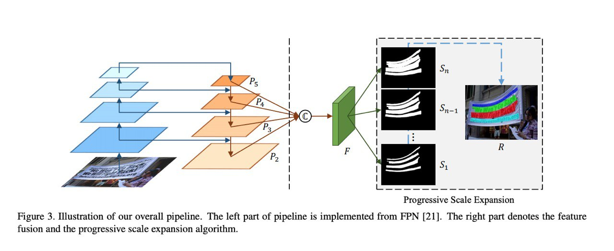

# PSENet: Progressive Scale Expansion Network

This repository contains a `tf.keras` implementation of [**PSENet**](https://arxiv.org/abs/1903.12473), a neural network for arbitrary-shape text detection.

The codebase is heavily inspired by the [Pytorch implementation](https://github.com/whai362/PSENet), provided by the original authors.

## Technical details

  

